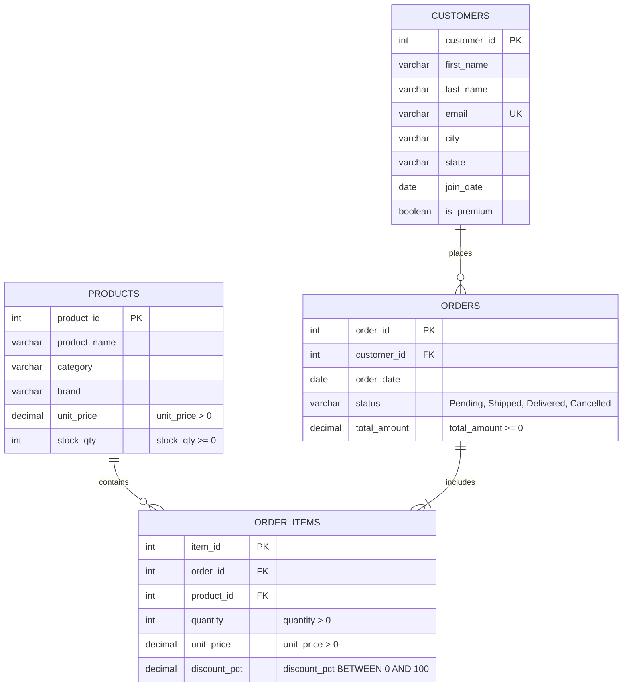

# ShopEase Sales Data Analysis: SQL Assignment

[](https://www.mysql.com/)
[](https://opensource.org/licenses/MIT)

This repository contains the database schema setup, indexes, and queries for analyzing sales data from the ShopEase e-commerce platform. The project is designed to run on MySQL 8.0+ or MySQL 8.4 LTS, and demonstrates core database concepts like constraint enforcement, query optimization (SARGability), aggregations, joins, and transactional consistency (ACID).

---

## Features

- **Relational Schema Setup**: Structured creation of `customers`, `products`, `orders`, and `order_items` tables with proper integrity constraints.
- **Performance Indexing**: Configured index lookup strategies on high-frequency filtering fields to improve query speeds.
- **Optimized Queries**: Demonstration of SARGable WHERE filtering, analytical grouping, and multi-table relational joins.
- **Transactional Integrity**: Standard SQL transactions and MySQL stored procedures incorporating exception-handling rollback scripts.

---

## Requirements

- **Database Engine**: MySQL Server 8.0 or 8.4 LTS (utilizing CHECK constraints and Stored Procedures).
- **Client Tools**: MySQL Workbench or the native command-line client.

---

## Repository Structure

The code is organized by task sections matching the assignment guidelines:

```
sql-assignment/
├── Database/
│   └── setup.sql              # Database DDL schema, indexes, seed data, and validation counts
├── Section_A/
│   └── basic_queries.sql      # Basic selections, schema properties, constraint checks
├── Section_B/
│   └── filtering_queries.sql  # Optimized filtering, indexing analysis, and SARGability
├── Section_C/
│   └── aggregation_queries.sql# GROUP BY, HAVING, and aggregate statistics
├── Section_D/
│   └── joins_queries.sql      # Joins (INNER, LEFT), multi-table joins, and FK constraints
├── Section_E/
│   └── advanced_queries.sql   # CASE conditional logic, ACID transactions, stored procedures
└── README.md                  # Project documentation (this file)
```

---

## Database Schema & Entity Relationships

The relational model consists of four tables managing customers, products, orders, and order items.

### Entity-Relationship Diagram



---

## Installation & Running Guide

### Step 1: Clone the Repository
```bash
git clone https://github.com/your-username/sql-assignment.git
cd sql-assignment
```

### Step 2: Database Initialization
Open the file `Database/setup.sql` in MySQL Workbench and execute it, or run the following command in your terminal:
```bash
mysql -u [username] -p < Database/setup.sql
```
This script creates the `shopease` database, sets up the table structures, configures indexes, populates the seed dataset, and runs basic verification counts.

---

## Section Details

### Section A: SQL Basics
*File: [basic_queries.sql](./Section_A/basic_queries.sql)*
- Basic SELECT and DISTINCT queries on customers and products.
- Identification of primary keys and their core properties (uniqueness and non-nullability).
- Constraint checks, including a commented-out query that triggers a CHECK constraint failure (`unit_price > 0`) when inserting negative prices.

### Section B: Filtering & Optimization
*File: [filtering_queries.sql](./Section_B/filtering_queries.sql)*
- WHERE filters for order statuses, dates, and product characteristics.
- Index analysis for `idx_orders_date` demonstrating how B-Tree index range scans avoid expensive table scans.
- Query rewrite for `YEAR(join_date) = 2024` to use a SARGable range comparison, enabling the query optimizer to utilize indexes.

### Section C: Aggregation
*File: [aggregation_queries.sql](./Section_C/aggregation_queries.sql)*
- Summaries using `COUNT`, `SUM`, `AVG`, `MIN`, and `MAX`.
- Categorizing orders and calculating total revenues grouped by order statuses.
- Use of the `HAVING` clause to filter categories based on aggregated average product prices.

### Section D: Joins & Relationships
*File: [joins_queries.sql](./Section_D/joins_queries.sql)*
- INNER JOINs mapping orders to customers, and a three-table join connecting orders to order items and products.
- LEFT JOIN listing all customers regardless of whether they have placed orders.
- Detailed differences between JOIN types (including how to emulate FULL OUTER JOIN in MySQL).
- Foreign Key behavior validation (commented insert that triggers a FK violation on `customer_id`).

### Section E: Advanced Concepts
*File: [advanced_queries.sql](./Section_E/advanced_queries.sql)*
- Price categorization into Budget, Mid-Range, and Premium using `CASE`.
- Counting Delivered and Undelivered orders on a single row using conditional aggregation.
- ACID properties breakdown mapped to a real-world bank transfer.
- Atomic transaction implementation using a standard script block and a stored procedure containing an SQLEXCEPTION handler for auto-rollbacks.

---

## License

This project is licensed under the MIT License.
