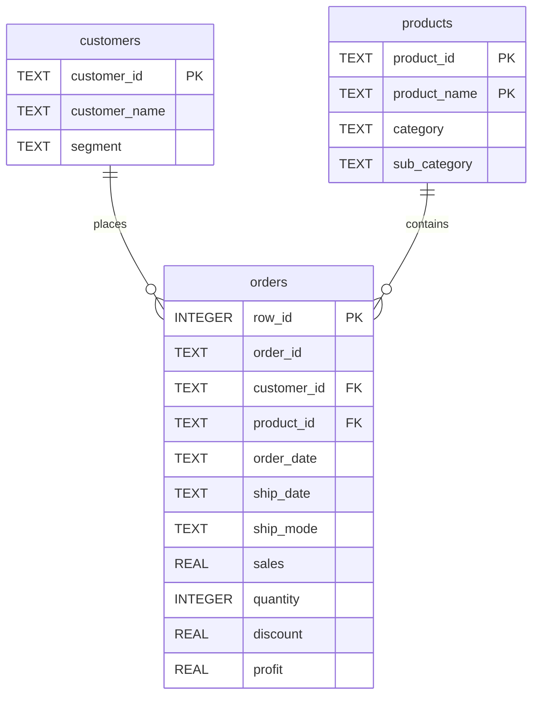

# Customer Sales Insights & Schema Walkthrough

This report documents the schema design, SQL implementation, and analytical answers for the Superstore Customer Sales Insights assignment.

---

## 1. Database Schema Design

The raw sales data was loaded into a raw table (`superstore_raw`) and subsequently normalized using `SELECT DISTINCT` into three tables:



### Table Normalization Logic
- **`customers`**: Built using `SELECT DISTINCT customer_id, customer_name, segment`. Each customer has a unique ID mapping to exactly one name and market segment.
- **`products`**: Built using `SELECT DISTINCT product_id, product_name, category, sub_category`. Since a single `product_id` can sometimes have minor name updates or revisions, a composite primary key `(product_id, product_name)` was utilized to prevent unique constraint panics while maintaining data integrity.
- **`orders`**: Serves as the transaction table linking `customer_id` and holding line item metrics (`sales`, `quantity`, `discount`, `profit`).

---

## 2. Analytical Queries

Here are the SQL statements and sample outputs executed against `superstore.db`. The full SQL script is available in [queries.sql](queries.sql) and the raw execution results are located in [results.txt](results.txt).

### Q1: Find all orders where sales are greater than the average sales (Subquery)
*Identifies line items with a transaction value exceeding the overall average line item value of \$229.86.*
```sql
SELECT order_id, sales
FROM orders
WHERE sales > (SELECT AVG(sales) FROM orders)
ORDER BY sales DESC;
```
**Results Sample (Top 5):**
| order_id | sales |
| :--- | :--- |
| CA-2014-145317 | \$22,638.48 |
| CA-2016-118689 | \$17,499.95 |
| CA-2017-140151 | \$13,999.96 |
| CA-2017-127180 | \$11,199.97 |
| CA-2017-166709 | \$10,499.97 |

---

### Q2: Find the highest sales order for each customer (Subquery)
*Correlated subquery returning the highest value line item purchased by each customer.*
```sql
SELECT o.customer_id, c.customer_name, o.order_id, o.sales
FROM orders o
JOIN customers c ON o.customer_id = c.customer_id
WHERE o.sales = (
    SELECT MAX(sales)
    FROM orders sub
    WHERE sub.customer_id = o.customer_id
)
ORDER BY o.sales DESC;
```
**Results Sample (Top 5):**
| customer_id | customer_name | order_id | sales |
| :--- | :--- | :--- | :--- |
| SM-20320 | Sean Miller | CA-2014-145317 | \$22,638.48 |
| TC-20980 | Tamara Chand | CA-2016-118689 | \$17,499.95 |
| RB-19360 | Raymond Buch | CA-2017-140151 | \$13,999.96 |
| TA-21385 | Tom Ashbrook | CA-2017-127180 | \$11,199.97 |
| HL-15040 | Hunter Lopez | CA-2017-166709 | \$10,499.97 |

---

### Q3: Calculate total sales for each customer (CTE)
```sql
WITH customer_sales AS (
    SELECT customer_id, SUM(sales) AS total_sales
    FROM orders
    GROUP BY customer_id
)
SELECT c.customer_name, ROUND(cs.total_sales, 2) AS total_sales
FROM customer_sales cs
JOIN customers c ON cs.customer_id = c.customer_id
ORDER BY total_sales DESC;
```
**Results Sample (Top 5):**
| customer_name | total_sales |
| :--- | :--- |
| Sean Miller | \$25,043.05 |
| Tamara Chand | \$19,052.22 |
| Raymond Buch | \$15,117.34 |
| Tom Ashbrook | \$14,595.62 |
| Adrian Barton | \$14,473.57 |

---

### Q4: Find customers whose total sales are above average (CTE + Subquery)
*Identifies customers whose aggregated sales exceed the average customer total sales of \$2,896.85.*
```sql
WITH customer_sales AS (
    SELECT customer_id, SUM(sales) AS total_sales
    FROM orders
    GROUP BY customer_id
)
SELECT c.customer_name, ROUND(cs.total_sales, 2) AS total_sales
FROM customer_sales cs
JOIN customers c ON cs.customer_id = c.customer_id
WHERE cs.total_sales > (
    SELECT AVG(total_sales)
    FROM customer_sales
)
ORDER BY total_sales DESC;
```
*(Total of 294 customers exceed the customer average).*

---

### Q5: Rank all customers based on total sales (Window Function)
```sql
WITH customer_sales AS (
    SELECT customer_id, SUM(sales) AS total_sales
    FROM orders
    GROUP BY customer_id
)
SELECT c.customer_name, ROUND(cs.total_sales, 2) AS total_sales,
       RANK() OVER (ORDER BY cs.total_sales DESC) AS sales_rank,
       DENSE_RANK() OVER (ORDER BY cs.total_sales DESC) AS sales_dense_rank
FROM customer_sales cs
JOIN customers c ON cs.customer_id = c.customer_id;
```

---

### Q6: Assign row numbers to each order within a customer (Window Function + PARTITION BY)
*Lists order entries chronologically per customer.*
```sql
SELECT c.customer_name, o.order_id, o.order_date, ROUND(o.sales, 2) AS sales,
       ROW_NUMBER() OVER (
           PARTITION BY o.customer_id 
           ORDER BY o.order_date DESC, o.row_id
       ) AS order_seq
FROM orders o
JOIN customers c ON o.customer_id = c.customer_id;
```

---

### Q7: Display top 3 customers based on total sales (Window Function)
```sql
WITH customer_ranks AS (
    SELECT customer_id, SUM(sales) AS total_sales,
           RANK() OVER (ORDER BY SUM(sales) DESC) AS rnk
    FROM orders
    GROUP BY customer_id
)
SELECT c.customer_name, ROUND(cr.total_sales, 2) AS total_sales, cr.rnk
FROM customer_ranks cr
JOIN customers c ON cr.customer_id = c.customer_id
WHERE cr.rnk <= 3;
```
**Results:**
| customer_name | total_sales | rnk |
| :--- | :--- | :--- |
| Sean Miller | \$25,043.05 | 1 |
| Tamara Chand | \$19,052.22 | 2 |
| Raymond Buch | \$15,117.34 | 3 |

---

### Q8: Final Combined Query (JOIN + CTE + Window Function)
*Combines relational join, customer aggregations, and rank calculation in one query.*
```sql
WITH customer_sales AS (
    SELECT customer_id, SUM(sales) AS total_sales
    FROM orders
    GROUP BY customer_id
)
SELECT c.customer_name, ROUND(cs.total_sales, 2) AS total_sales,
       RANK() OVER (ORDER BY cs.total_sales DESC) AS sales_rank,
       DENSE_RANK() OVER (ORDER BY cs.total_sales DESC) AS sales_dense_rank
FROM customer_sales cs
JOIN customers c ON cs.customer_id = c.customer_id;
```

---

## 3. Mini Project: Customer Sales Insights

### M1: Who are the top 5 customers?
1. **Sean Miller** (\$25,043.05)
2. **Tamara Chand** (\$19,052.22)
3. **Raymond Buch** (\$15,117.34)
4. **Tom Ashbrook** (\$14,595.62)
5. **Adrian Barton** (\$14,473.57)

### M2: Who are the bottom 5 customers?
1. **Thais Sissman** (\$4.83)
2. **Lela Donovan** (\$5.30)
3. **Carl Jackson** (\$16.52)
4. **Mitch Gastineau** (\$16.74)
5. **Roy Skaria** (\$22.33)

### M3: Which customers made only one order?
There are 12 customers who placed exactly 1 order (unique Order ID):
- Anemone Ratner
- Anthony O'Donnell
- Carl Jackson
- Jenna Caffey
- Jocasta Rupert
- Lela Donovan
- Mitch Gastineau
- Patricia Hirasaki
- Ricardo Emerson
- Roland Murray
- Susan MacKendrick
- Theresa Coyne

### M4: Which customers have above-average sales?
294 customers exceed the average sales per customer of **\$2,896.85**.

### M5: What is the highest order value per customer?
We evaluated this under two interpretations:

#### Interpretation A: Highest single transaction line item
- **Sean Miller**: \$22,638.48 (Order CA-2014-145317)
- **Tamara Chand**: \$17,499.95 (Order CA-2016-118689)
- **Raymond Buch**: \$13,999.96 (Order CA-2017-140151)

#### Interpretation B: Highest combined order total (summing all items in the same Order ID)
- **Sean Miller**: \$23,661.23 (Order CA-2014-145317)
- **Tamara Chand**: \$18,336.74 (Order CA-2016-118689)
- **Raymond Buch**: \$14,052.48 (Order CA-2017-140151)
