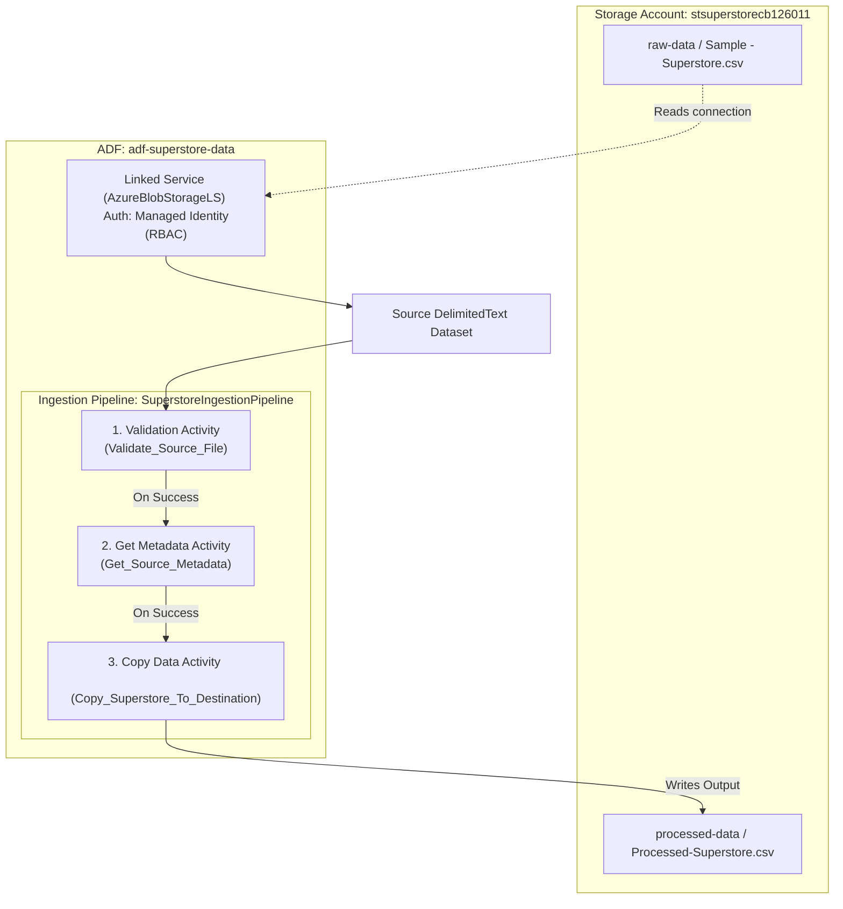
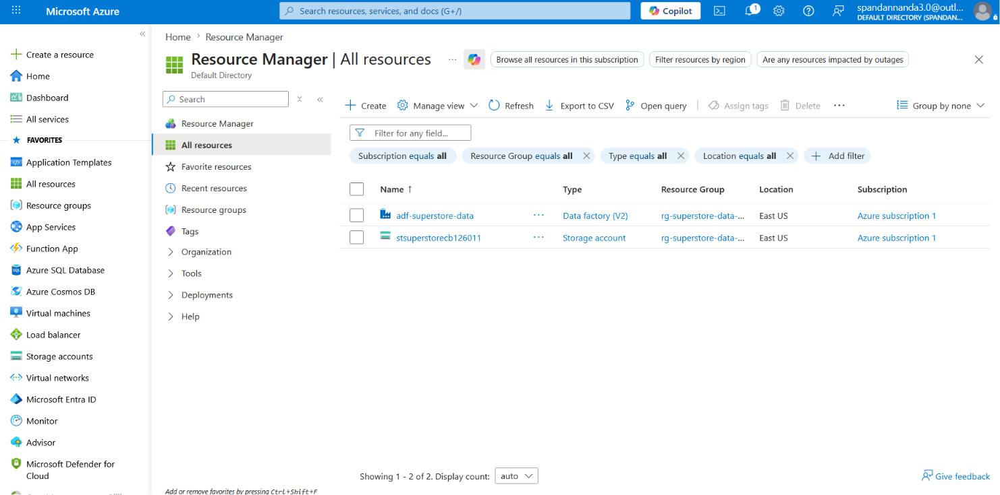
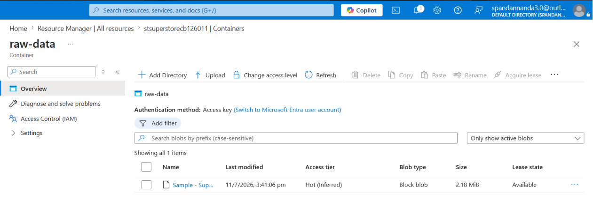
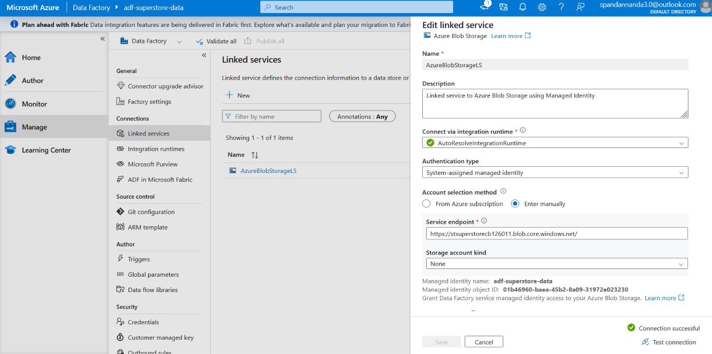
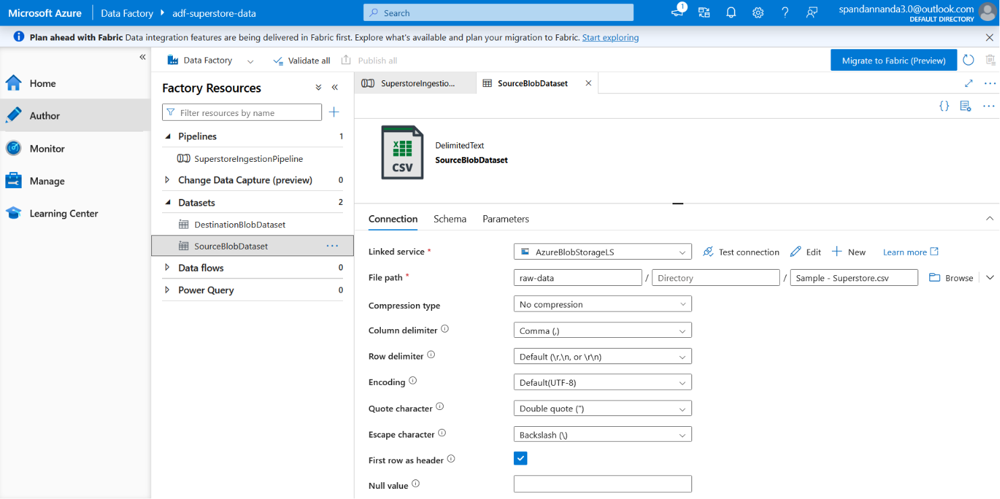
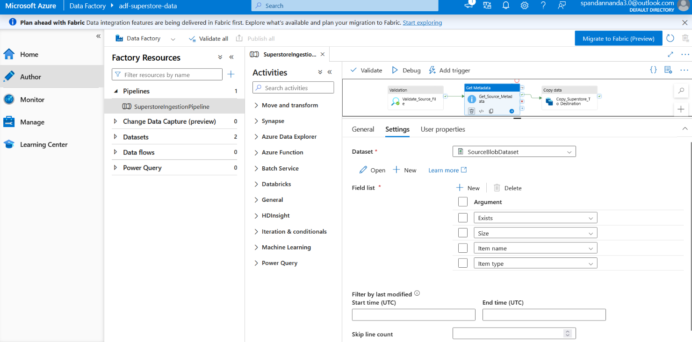
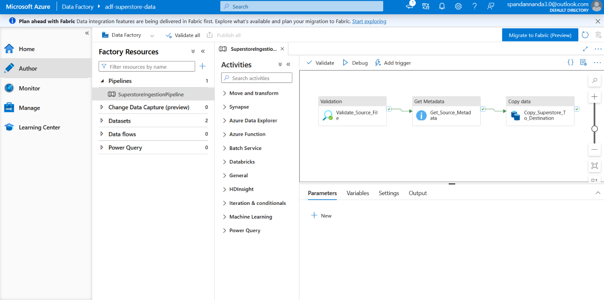
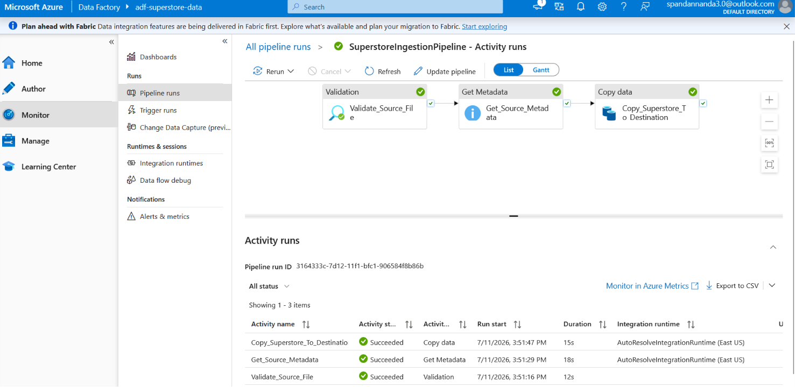
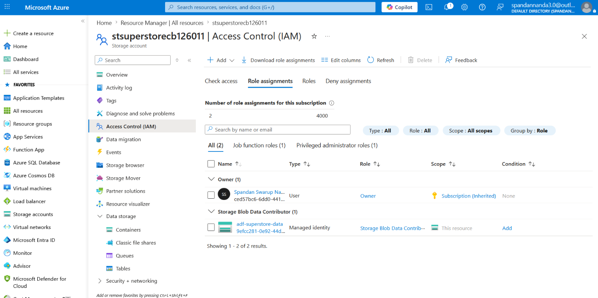

# Azure Data Ingestion Pipeline: Superstore Retail Ingestion

An end-to-end cloud data engineering project implementing a robust, secure, and metadata-validated batch ingestion pipeline. The workflow reads the **Superstore CSV dataset** from a raw Azure Blob Storage container, validates its availability and metadata, and copies it to a processed destination container using **Azure Data Factory (ADF)** and **Role-Based Access Control (RBAC)**.

---

## 🏗️ Architecture & Data Flow



---

## 📂 Repository Structure

```directory
Week4_Azure_Data_Pipeline/
│
├── adf_config/                 # Azure Data Factory resource definitions
│   ├── linkedService/
│   │   └── AzureBlobStorageLS.json          # Blob Storage Linked Service using Managed Identity
│   ├── dataset/
│   │   ├── SourceBlobDataset.json           # Input dataset schema & path
│   │   └── DestinationBlobDataset.json      # Output dataset schema & path
│   └── pipeline/
│       └── SuperstoreIngestionPipeline.json # Multi-activity pipeline configuration
│
├── assets/                     # Architectural & Portal execution screenshots
│   ├── screenshot_resource_group.png
│   ├── screenshot_storage_setup.png
│   ├── screenshot_linked_service.png
│   ├── screenshot_dataset.png
│   ├── screenshot_get_metadata.png
│   ├── screenshot_pipeline_design.png
│   ├── screenshot_pipeline_execution.png
│   └── screenshot_iam_roles.png
│
├── dataset/                    # Local CSV datasets
│   └── Sample - Superstore.csv
│
├── deploy_pipeline.py          # Python automation CLI script for resources & ADF setup
├── validate_configs.py         # Python validator tool for testing configuration integrity
└── README.md                   # Repository documentation
```

---

## 🚀 Key Data Engineering Concepts Implemented

1. **Batch Ingestion & Processing**: Designed as a scheduled batch execution to move static files (Video 2: Batch vs. Stream).
2. **Metadata-Driven Gates**: Utilizes ADF's **Validation** and **Get Metadata** activities sequentially. The pipeline pauses execution if the source file is missing or incomplete, preventing downstream processing failures (Video 9: Validation, Video 8: Pipeline execution).
3. **Keyless Cloud Security (RBAC)**: Leverages Azure Active Directory **System-Assigned Managed Identity** for Data Factory. Instead of using insecure access keys inside connection strings, ADF authentication is secured via the **Storage Blob Data Contributor** IAM role (Video 7: Azure RBAC).
4. **Modularity & Reusability**: Linked services are decoupled from dataset schemas, enabling easy swapping of file properties without altering connection templates (Video 5: Linked Services & Datasets).

---

## 🛠️ Step-by-Step Implementation Guide

### Phase 1: Resource Provisioning
*   Create a Resource Group `rg-superstore-data-pipeline` in region `eastus` (Video 3: Azure Basics).
*   Create a Storage Account `stsuperstorecb126011` with containers `raw-data` (source) and `processed-data` (destination) (Video 4: Blob Storage).
*   Upload the source dataset `Sample - Superstore.csv` to the `raw-data` container.

### Phase 2: Role-Based Access Control Setup
*   Enable **System-Assigned Managed Identity** on the Azure Data Factory resource.
*   Assign the **Storage Blob Data Contributor** role to the Data Factory's principal ID at the storage account scope (Video 7).

### Phase 3: ADF Configuration Setup
*   Configure the Linked Service `AzureBlobStorageLS` using the `serviceEndpoint` authentication block.
*   Create `SourceBlobDataset` pointing to container `raw-data` and file `Sample - Superstore.csv`.
*   Create `DestinationBlobDataset` pointing to container `processed-data` and file `Processed-Superstore.csv`.

### Phase 4: Ingestion Pipeline Orchestration
*   Chain three sequential activities:
    1.  **Validate_Source_File**: Blocks pipeline execution until the source file exists.
    2.  **Get_Source_Metadata**: Inspects the attributes of the source file (e.g., size, childItems).
    3.  **Copy_Superstore_To_Destination**: Copies the validated file to the output container.

---

## 💻 How to Validate & Deploy

### Prerequisites
- Python 3.11 or higher.
- [Azure CLI](https://learn.microsoft.com/en-us/cli/azure/install-azure-cli) installed and authenticated via `az login`.

### 1. Run Configuration Lint & Validation Tests
To check that the JSON templates have correct properties, references, and sequencing, execute:
```bash
python validate_configs.py
```
*Expected Output:*
```text
           ADF CONFIGURATION VALIDATOR

[PASS] Successfully parsed JSON: adf_config\linkedService\AzureBlobStorageLS.json
[PASS] Successfully parsed JSON: adf_config\dataset\SourceBlobDataset.json
[PASS] Successfully parsed JSON: adf_config\dataset\DestinationBlobDataset.json
[PASS] Successfully parsed JSON: adf_config\pipeline\SuperstoreIngestionPipeline.json

   SUCCESS: ALL CONFIGURATIONS VALID AND DYNAMICALLY LINKED!
```

### 2. Execute Automated Infrastructure Deployment (Dry-run / Live)
You can run the python deployment script in dry-run mode (default) to review the Azure CLI commands:
```bash
python deploy_pipeline.py
```
To run the actual live provisioning (requires active Azure subscription credentials):
```bash
# Enable the --live flag to execute live CLI commands
python deploy_pipeline.py --live
```

---

## 📊 Portal Demonstration & Screenshots

Below is the verified screenshot log from our active Azure Portal run:

### 1. Azure Resource Group Configured


### 2. Storage Containers & CSV Dataset


### 3. Linked Service Configuration (Connection Successful)


### 4. Delimited Dataset Scheme Details


### 5. Get Metadata Activity Settings


### 6. ADF Ingestion Pipeline Blueprint


### 7. Pipeline Run Monitor (Succeeded Ingestion)


### 8. Identity IAM Role Assignment (RBAC Setup)

