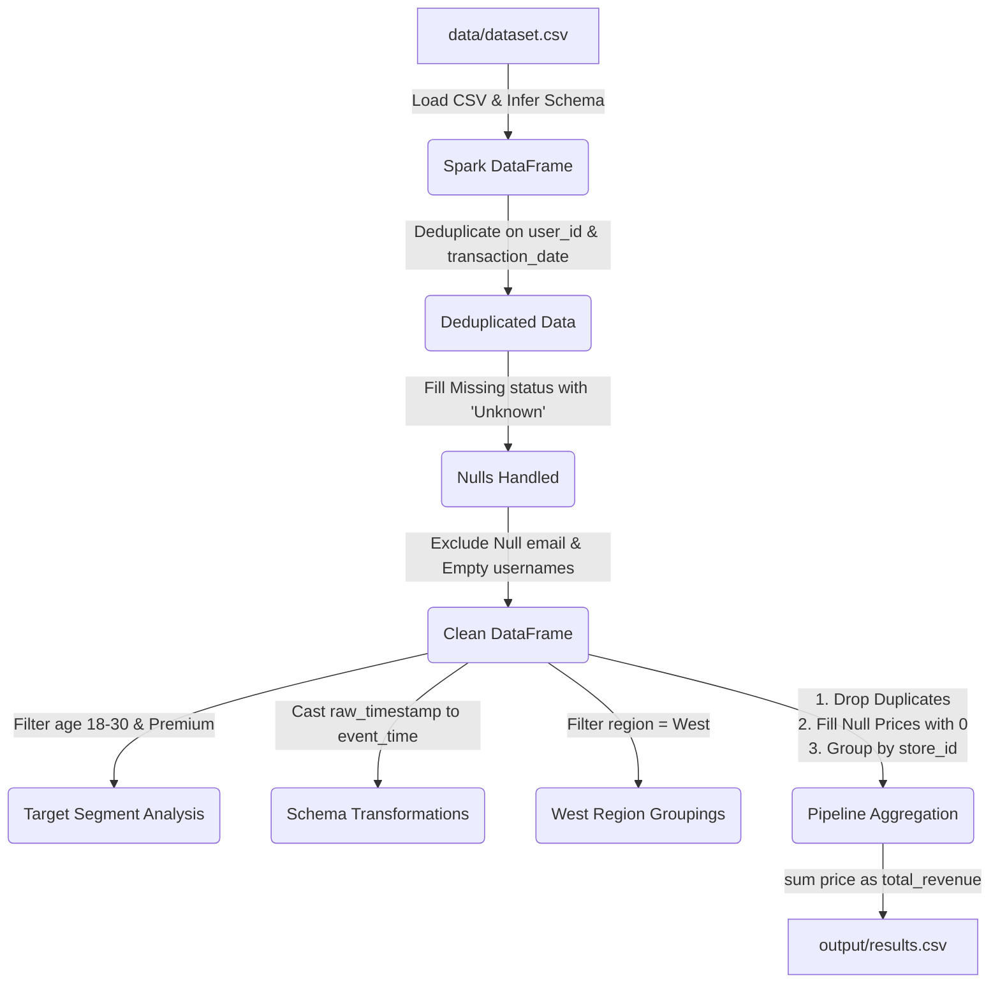

# Week 5 Apache Spark DataFrame Basics

This repository contains the deliverables for the **Week 5 Apache Spark Assignment** of the Celebal Data Engineering Internship. This assignment focuses on the fundamentals of big data processing using **Apache Spark DataFrames (PySpark)**, highlighting performance optimizations, in-memory computing, and standard ETL (Extract, Transform, Load) pipelines.

---

## 📂 Repository Structure

The assignment workspace is structured as follows:

```text
Week5_Spark_Assignment/
├── data/
│   └── dataset.csv              # Input dataset (1,510 records containing duplicates, nulls, and outliers)
├── notebook/
│   └── spark_basics.ipynb       # Production-ready Jupyter Notebook with complete PySpark pipeline code
├── output/
│   └── results.csv              # Output aggregation showing total calculated revenue per store_id
├── QNA.md                       # Structured Markdown document containing answers to the 15 PDF questions
└── README.md                    # Professional project documentation (this file)
```

---

## ⚙️ Data Engineering ETL Pipeline

Below is a visual representation of the ETL pipeline implemented in PySpark:



---

## 📊 Dataset Specifications

The ETL pipeline processes a synthetic dataset (`dataset.csv`) comprising **1,510 rows** with the following schema:

| Column Name | Data Type | Description / Data Quality Issues Injected |
| :--- | :--- | :--- |
| `user_id` | `Integer` | Customer Identifier (contains duplicate transactions) |
| `username` | `String` | Customer username (contains blank `""` strings) |
| `email` | `String` | Email address (contains `null` records) |
| `age` | `Integer` | Customer age (ranging from 15 to 60) |
| `subscription` | `String` | Subscription tiers: `Premium`, `Basic`, `Standard`, `Free` |
| `region` | `String` | Operations region: `East`, `West`, `Midwest`, `South` |
| `city` | `String` | City location (skewed distribution: New York has 450, Los Angeles has 350) |
| `product_category`| `String` | Product Category: `Electronics`, `Clothing`, `Home & Kitchen`, `Books`, `Sports` |
| `sale_amount` | `Double` | Transaction sale amount |
| `price` | `Double` | Item price (contains `null` values representing free/incomplete records) |
| `store_id` | `Integer` | Store Identifier: `101`, `102`, `103`, `104` |
| `transaction_date`| `Date` | Date format: `YYYY-MM-DD` |
| `raw_timestamp` | `String` | Messy raw timestamp formats (e.g. `YYYY-MM-DD HH:MM:SS` or `DD/MM/YYYY`) |
| `status` | `String` | Account status (contains `null` values) |

---

## 🚀 Workflow & Processing Steps

The Jupyter Notebook [spark_basics.ipynb](notebook/spark_basics.ipynb) implements the following operations:

### 1. Spark Session Initialization
Initializes a local Spark Session.
```python
spark = SparkSession.builder \
    .appName("SparkDataFrameBasics") \
    .getOrCreate()
```

### 2. Data Cleaning & Integrity Check
* Removes duplicate entries matching on a composite key of `user_id` and `transaction_date`.
* Imputes missing categorical records in `status` to `"Unknown"`.
* Excludes rows containing empty `username` strings or `null` email values to clean contact tables.

### 3. Segment & Region Filtering
* Filters target age segments: customers aged between **18 and 30** (inclusive) holding a **Premium** subscription.
* Segregates transactional logs belonging to the **West** region.

### 4. Schema Evolution & Casting
* Standardizes date formats by casting the `raw_timestamp` column to a `TimestampType` and renaming it to `event_time`.

### 5. Multi-Metric Aggregations & Grouping
* Calculates summary statistics (`min()`, `max()`, `avg()`) for pricing.
* Computes average sales per product category inside the West region.
* Filters for geographic regions displaying high-volume traffic (city count > 100).

---

## 📈 Key Insights & Results

### Store Revenue Output (ETL Pipeline Results)
The final step of the pipeline cleans the dataset, sets missing prices to `0`, groups transaction value by store, and exports the aggregates to [results.csv](output/results.csv).

| Store ID | Total Revenue ($) |
| :---: | :--- |
| **101** | \$79,699.10 |
| **102** | \$88,791.44 |
| **103** | \$79,588.55 |
| **104** | \$89,696.76 |

### City Demographics Skew (Count > 100)
Grouping the clean records by city identified two high-density urban zones displaying record counts above 100:

* **New York**: 387 Clean Records
* **Los Angeles**: 251 Clean Records

---

## 📖 References & Concepts Covered
The pipeline logic was built using data cleaning and aggregation guidelines covered in:
* **Alex The Analyst**: Data Cleaning in Pandas (translating vectorization to distributed Spark DataFrames).
* **Keith Galli / LearnitGuide**: Handling Null Values, Data Standardizations, and Record Exclusions.
* **Data University**: Multi-Aggregation GroupBy and Condition-based Group Filtering.
